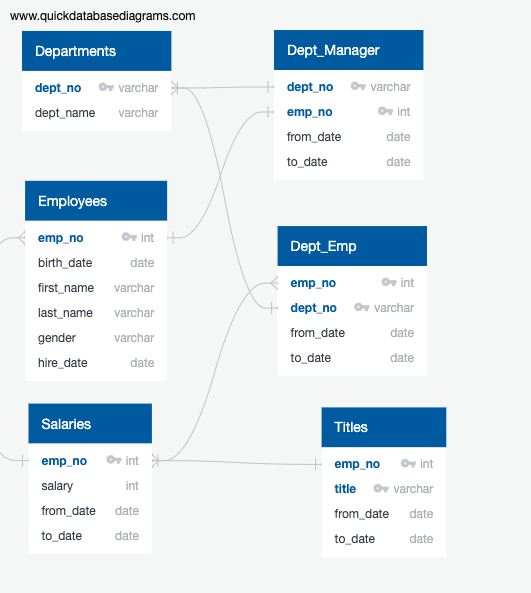
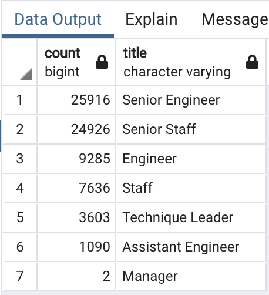
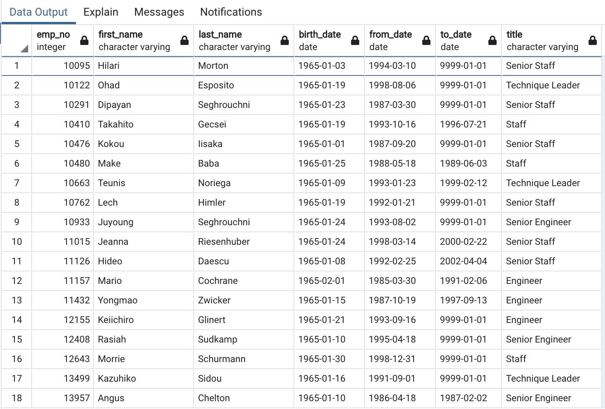

# Pewlet-Hackard-Analysis

## Overview of Project:

The purpose of this analysis is to conduct a Database analysis for Pewlett Hackard with detailed information on the number of future retirees from all departments currently working at the company to be able to prepare a plan to hire new staff and also to prepare a mentorship initiative. 

The parameters were based on the birth dates ranging from 1952 to 1955 and hired dates from 1985 to 1988.

# ERD

Below is the Entity Relationship Diagram that I used to visualize the relationship between the data sources and the structure of the company's employees plan.

## Results:

# Number of Retiring Employees by Title

# Employees Eligible for Mentorship Program

## Summary

From the analysis, we can see that there are thousands of job positions that will soon be open due to employees reaching retirement age.  Senior Engineering will have the greatest number of job openings.  The second image communicates that there are several individuals who are qualified for the mentorship program offered by the Pewlet and Hackard Company.